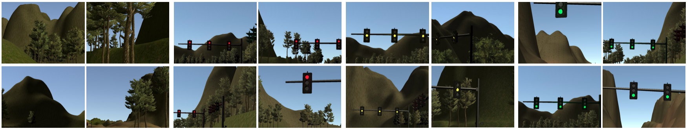
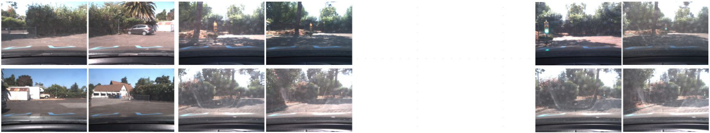

# Traffic Light Classifier

Simple traffic light classifier to be integrated in the capstone project.

---

## Dataset

### Simulator dataset
**Number of frames:** 1324 frames

**Resolution:** 800x600 pixel

**Classes:** {none, red, yellow, green}

**Samples:**

### Udacity circuit dataset
**Number of frames:** 1151 frames

**Resolution:** 800x600 pixel

**Classes:** {none, red, green}

**Samples:**

### Mixed dataset

The network has been from the dataset obtained merging the two dataset above.

###

All three datasets are available in this [shared folder](https://drive.google.com/open?id=0Bx9YaGcDPu3XSlMxeHlPZEIyRzQ).
